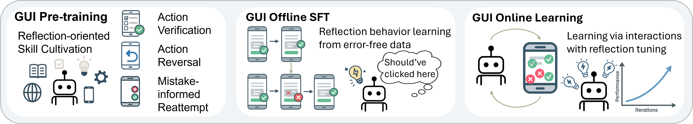

# GUI Reflection: Empowering Multimodal GUI Models with Self-Reflection Behavior

[](https://arxiv.org/abs/2506)
[](https://penghao-wu.github.io/GUI_Reflection/)



## Contents:
1. [Installation](#install)
2. [Data](#data)
3. [Evaluation](#evaluation)
4. [Agent Inference](#inference)
5. [Training](#training)
6. [Online Environment](#env)
7. [License](#license)
8. [Citation](#citation)
9. [Acknowledgement](#acknowledgement)

## Installation <a name="install"></a>

Install the `internvl` environment following the guidelines in [InternVL](https://github.com/OpenGVLab/InternVL?tab=readme-ov-file#quick-start-with-huggingface).  
Add `internvl_chat` to PYTHONPATH: `export PYTHONPATH=$PYTHONPATH:path_to_GUI_Reflection_repo/internvl_chat`

## Data <a name="data"></a>

The training and evaluation data in the GUI Reflection Task Suite are provided in [
GUI_Reflection_Task_Suite_Benchmark](https://huggingface.co/datasets/craigwu/GUI_Reflection_Task_Suite_Benchmark) and [
GUI_Reflection_Task_Suite_train](https://huggingface.co/datasets/craigwu/GUI_Reflection_Task_Suite_train).  
The offline SFT data are provided in [GUI_Reflection_SFT_train](https://huggingface.co/datasets/craigwu/GUI_Reflection_SFT_train).  
The data we provided does not include the source images. You can download the source images from the source datasets accordingly.


## Evaluation <a name="evaluation"></a>

We provide the evaluation script to evaluate on the GUI Reflection Task Suite.  
You should read and correctly set the required fields in `internvl_chat/eval/launch_eval.sh` and launch the evaluation by
```
cd internvl_chat/eval && GPUS=8 bash launch_eval.sh
```

## Agent Inference <a name="inference"></a>
We implement an agent class in `internvl_chat/gui_agent.py` to run our model as a GUI agent to perform GUI tasks.  
You can initialize the agent model with `gui_agent = GUI_Reflection_Agent(model_path)`.   
Before running a new task, reset the agent by `gui_agent.reset()`.  
To get the prediction from the agent at each step, run `action = gui_agent.step(image, task_goal)`.  

## Training <a name="training"></a>
We provide the training script to perform the offline SFT training in `internvl_chat/train_scripts/offline_sft.sh`.   
You need to first prepare the offline SFT data and set the data+image path in `internvl_chat/train_scripts/offline_sft_data.json`.  

## Online Environment <a name="env"></a>
TODO

## License <a name="license"></a>

This project is under the Apache-2.0 license. See [LICENSE](LICENSE) for details.

## Citation <a name="citation"></a>
Please consider citing our paper if you find this project helpful for your research:

```bibtex
TODO
```

## Acknowledgement <a name="acknowledgement"></a>
-  This work is built upon [InternVL](https://github.com/OpenGVLab/InternVL). 


